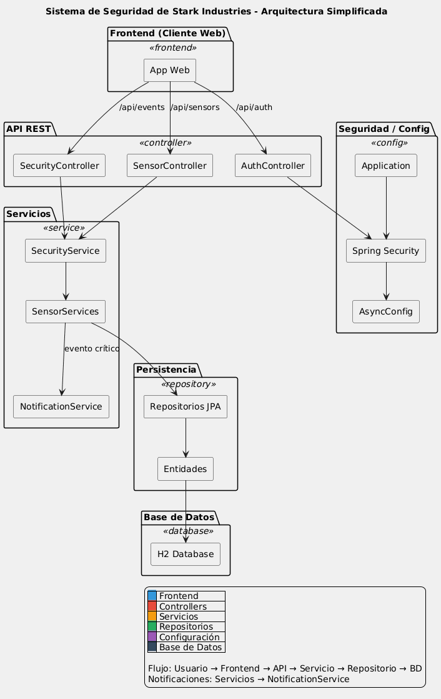

# 🛡️ Sistema de Seguridad de Stark Industries

## Miembros del Grupo
- **Binhao Xu**
- **Diego Pizarro**

---

## Descripción del Proyecto

Sistema de seguridad concurrente desarrollado con **Spring Boot** que gestiona múltiples sensores en tiempo real para Stark Industries. El sistema permite monitorizar sensores de movimiento, temperatura y control de acceso, procesando eventos de forma concurrente y generando alertas críticas cuando es necesario.

---

---

## Arquitectura del Sistema



---

## Lógica de la Solución

El sistema implementa una arquitectura basada en **Spring Framework** que utiliza:

1. **Inversión de Control (IoC)** para gestionar dependencias automáticamente
2. **Spring Data JPA** para persistencia de datos sin código SQL manual
3. **Procesamiento asíncrono** con `@Async` para manejar múltiples sensores simultáneamente
4. **Spring Security** con autenticación personalizada basada en headers HTTP
5. **API REST** para comunicación entre frontend y backend
6. **Gráficos en tiempo real** con Chart.js para monitorización del sistema

El flujo principal es:
- Los **sensores** detectan eventos (movimiento, temperatura anómala, accesos no autorizados)
- El **backend** procesa estos eventos de forma **concurrente** en hilos separados
- Los eventos **críticos** generan **alertas automáticas**
- Todo se **persiste en base de datos H2**
- El **frontend** visualiza el estado en tiempo real con actualización automática

---

## Estructura de Archivos Relevantes

### **Backend (Java/Spring Boot)**

#### Configuración
- **`pom.xml`**: Dependencias del proyecto (Spring Boot, Spring Security, Spring Data JPA, H2, Lombok, Jackson)
- **`application.properties`**: Configuración de la aplicación (base de datos H2, JPA, logging, pool de hilos asíncronos)
- **`SecuritySystemApplication.java`**: Clase principal con `@SpringBootApplication` y `@EnableAsync` para habilitar procesamiento asíncrono

####  Configuración Spring (`config/`)
- **`SecurityConfig.java`**: Configuración de Spring Security con roles (ADMIN, SECURITY_OFFICER, VIEWER) y protección de endpoints por rol
- **`CustomAuthenticationFilter.java`**: Filtro personalizado que lee headers `X-User` y `X-Role` para autenticar sin Basic Auth
- **`AsyncConfig.java`**: Configura el `ExecutorService` con pool de 10-20 hilos para procesamiento concurrente de sensores
- **`DataInitializer.java`**: Inicializa 9 sensores de prueba al arrancar la aplicación (3 de cada tipo)

#### Modelo de Datos (`model/`)
- **`Sensor.java`**: Entidad JPA que representa un sensor (id, tipo, ubicación, estado activo/inactivo)
- **`SensorEvent.java`**: Entidad JPA para eventos detectados (sensor, tipo de evento, descripción, criticidad, timestamp)
- **`SensorType.java`**: Enum con los tipos de sensores (MOVEMENT, TEMPERATURE, ACCESS)
- **`SensorEventDTO.java`**: Data Transfer Object para evitar problemas de serialización JSON con proxies de Hibernate

#### Repositorios (`repository/`)
- **`SensorRepository.java`**: Spring Data JPA repository para operaciones CRUD de sensores (métodos automáticos como `findByType`, `findByActiveTrue`)
- **`SensorEventRepository.java`**: Repository para eventos con queries personalizadas (`@Query` para buscar eventos entre fechas, contar críticos)

#### Servicios (`service/`)
- **`SensorService.java`**: Interfaz que define el contrato para procesar sensores (principio de IoC)
- **`MovementSensorService.java`**: Implementación para sensores de movimiento, marca como crítico si detecta movimiento, usa `@Async` y `@Transactional`
- **`TemperatureSensorService.java`**: Procesa sensores de temperatura, crítico si >50°C o <0°C
- **`AccessSensorService.java`**: Gestiona control de acceso, crítico si el acceso es denegado
- **`SecurityService.java`**: Coordinador que usa `@Qualifier` para resolver qué servicio usar según el tipo de sensor
- **`NotificationService.java`**: Envía alertas asíncronas cuando hay eventos críticos (simula emails, push notifications, alarmas)

#### Controladores REST (`controller/`)
- **`AuthController.java`**: Endpoint `/api/auth/login` para autenticación sin Spring Security básica, valida credenciales y retorna datos del usuario
- **`SensorController.java`**: Endpoints REST para listar sensores (`GET /api/sensors`), procesar uno (`POST /api/sensors/{id}/process`) y procesamiento batch concurrente (`POST /api/sensors/process-batch`)
- **`SecurityController.java`**: Endpoints para eventos (`GET /api/events`, `/api/events/critical`) y estadísticas del sistema (`GET /api/events/stats`)

---

### **Frontend (HTML/CSS/JavaScript)**

####  Interfaz de Usuario
- **`index.html`**: Interfaz principal con dashboard de estadísticas, grid de sensores, lista de eventos, gráfico de rendimiento en tiempo real y controles para simular eventos
- **`styles.css`**: Estilos con diseño futurista inspirado en Stark Industries (gradientes azules, tarjetas con sombras, animaciones, modo responsive)
- **`app.js`**: Lógica del frontend que gestiona login sin Basic Auth, llamadas API con headers `X-User/X-Role`, actualización automática cada 5 segundos, simulación de eventos y gráfico Chart.js en tiempo real

####  Visualización
- **Chart.js (CDN)**: Librería para el gráfico de rendimiento en tiempo real que muestra CPU, Memoria y Eventos/min actualizándose cada 2 segundos


##  Cómo Ejecutar el Proyecto

### Requisitos
- Java 17 o superior
- Maven 3.6+
- IntelliJ IDEA (recomendado) o cualquier IDE compatible

### Pasos
1. Clonar el repositorio:
   ```bash
   git clone https://github.com/PaxuitoGIT/seguridad.git
   cd seguridad
   ```

2. Compilar con Maven:
   ```bash
   mvn clean install
   ```

3. Ejecutar la aplicación:
   ```bash
   mvn spring-boot:run
   ```
   O desde IntelliJ: Run `SecuritySystemApplication.java`

4. Abrir en el navegador:
   ```
   http://localhost:8080
   ```

5. Iniciar sesión con uno de estos usuarios:
    - **tony.stark** / jarvis123 (ADMIN)
    - **pepper.potts** / stark123 (SECURITY_OFFICER)
    - **happy.hogan** / driver123 (VIEWER) NOTA: Viewer dará error 403 si intenta simular porque no tiene permisos.

---

##  Demostración de Concurrencia

Usa el botón **"Procesar 5 Sensores Simultáneamente"** y observa la consola de IntelliJ:

```
🏃 [MOVEMENT] Procesando sensor: MOV-001 en hilo: SensorThread-1
🌡️  [TEMPERATURE] Procesando sensor: TEMP-001 en hilo: SensorThread-2
🚪 [ACCESS] Procesando sensor: ACC-001 en hilo: SensorThread-3
🏃 [MOVEMENT] Procesando sensor: MOV-002 en hilo: SensorThread-4
🌡️  [TEMPERATURE] Procesando sensor: TEMP-002 en hilo: SensorThread-5
```

**Todos se procesan en hilos diferentes simultáneamente**, demostrando el procesamiento concurrente con Spring `@Async`.

---

##  Base de Datos

- **Tipo**: H2 (en memoria)
- **Consola**: http://localhost:8080/h2-console
- **JDBC URL**: `jdbc:h2:mem:starkdb`
- **Usuario**: `stark`
- **Contraseña**: `jarvis2024`

### Tablas:
- `sensors`: Información de los 9 sensores
- `sensor_events`: Todos los eventos detectados

---

## Tecnologías Utilizadas

- **Backend**: Spring Boot 3.2.0, Spring Security, Spring Data JPA
- **Base de Datos**: H2 Database (en memoria)
- **Frontend**: HTML5, CSS3, JavaScript (Vanilla)
- **Gráficos**: Chart.js 4.4.0
- **Build**: Maven
- **Utilidades**: Lombok, Jackson

---

## Características Principales

- Procesamiento **concurrente** de múltiples sensores
- Detección automática de **eventos críticos**
- **Notificaciones** en tiempo real
- **Dashboard visual** con estadísticas
- **Gráfico de rendimiento** actualizado cada 2 segundos
- **Control de acceso** por roles (ADMIN, OFFICER, VIEWER)
- **Persistencia** en base de datos H2
- **API REST** completamente funcional
- **Actualización automática** cada 5 segundos
- Interfaz **responsive** y moderna

---

## Notas Técnicas

- El sistema usa **autenticación stateless** con headers HTTP (`X-User`, `X-Role`)
- Los sensores se procesan **asíncronamente** en un pool de hasta 20 hilos
- Las transacciones garantizan **atomicidad** en las operaciones de base de datos
- Spring Data elimina la necesidad de escribir **SQL manual**
- El patrón DTO evita problemas de **serialización JSON** con lazy loading de Hibernate

---

**Desarrollado por**: Binhao Xu y Diego Pizarro  
**Asignatura**: Programación de Servicios y Procesos  
**Tecnología**: Spring Framework + Spring Boot  
**Año**: 2025

---